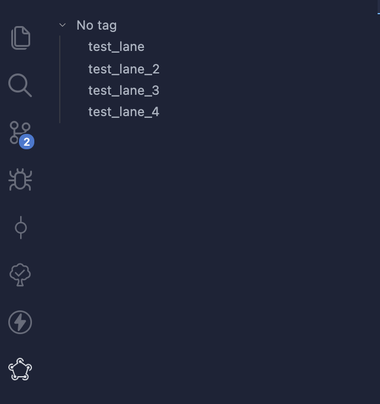
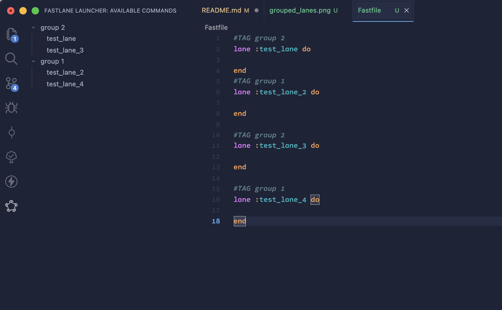

# Fastlane Launcher

This is a simple extension for VsCode that parses and displays all the available lanes present in your Fastfile.

# Features

- All your lanes are inserted in a lateral menu with their description for a better handling of your automations
    
- With `#TAG` comment you can also group them
    

## Extension Settings

The settings exposed by this extension are:

- `fastlane-launcher.fastlaneCommand`: with this you can specify which command should use to launch the lanes. By default it's `fastlane`, but you may use `bundle exec fastlane`

# Release notes
# 0.0.5
- Modified README with some images of how it works
# 0.0.4

- Fixed automatic `Fastfile` finding

# 0.0.3

- Changed `tag :` to `#TAG` to group different lanes
- Fixed the `onClick` listener on tag entry

# 0.0.2

- Now private lanes will be ignored
- Added the possibility to handle a `tag :` descriptor to group lanes

# 0.0.1

- Displays all the available lanes on a panel of the activity bar
- With `shift+alt+l`it will show you all the available lanes from a quick pick dropdown
- The edits inside Fastfile are reloaded instantly
